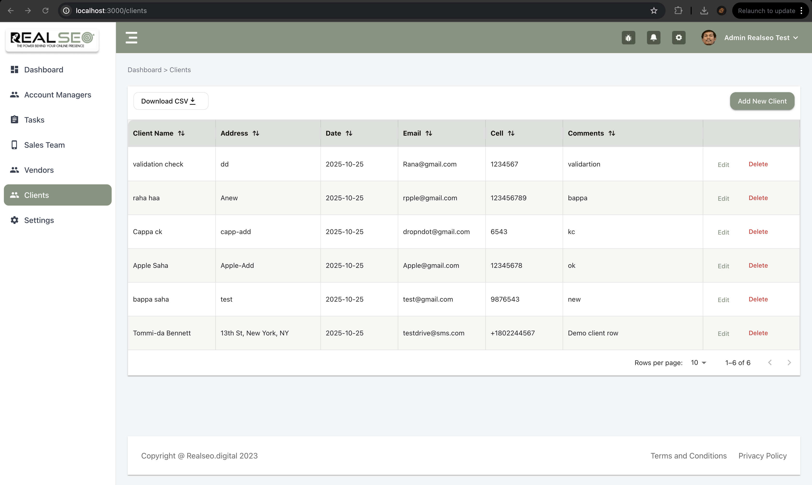
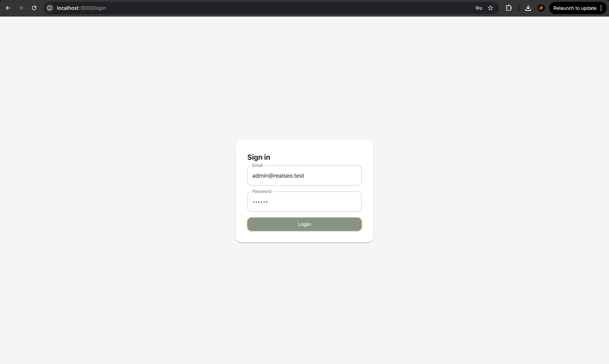
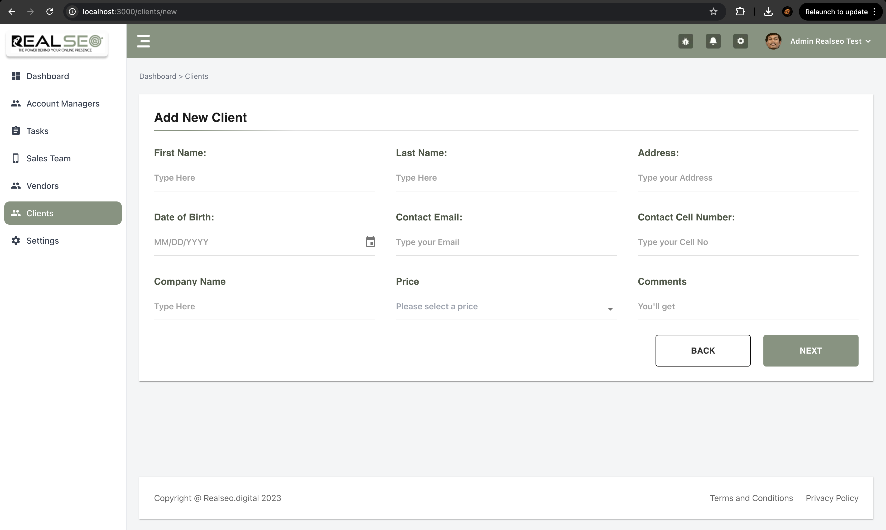
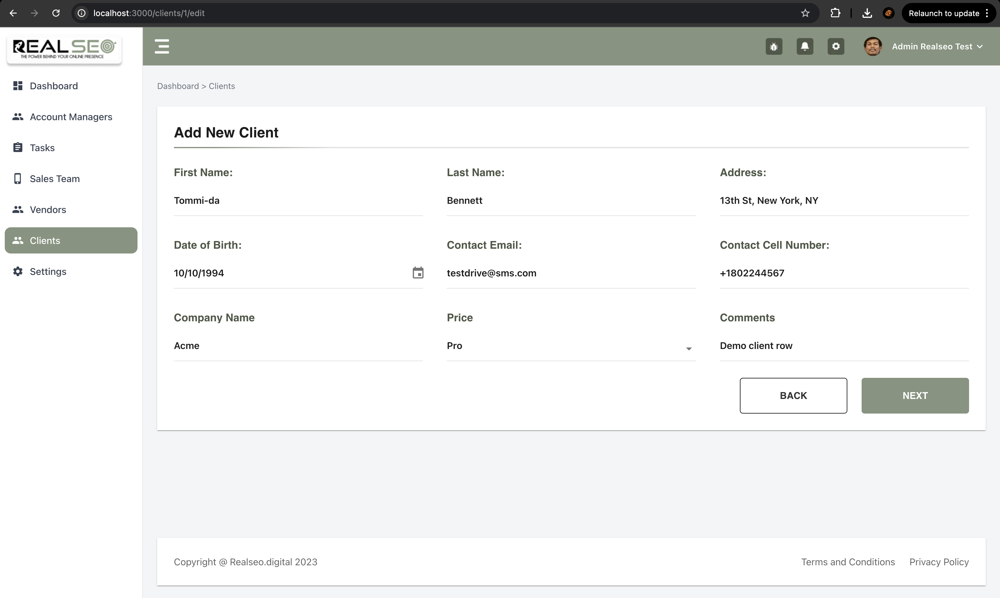

# 🛠️ Run everything on macOS (M1)

If you are a mac user then, As i am using mac silicon:

    brew install mysql
    brew services start mysql
    mysql_secure_installation

## project demo 👇

[](https://drive.google.com/file/d/1rnTSwXaMJVJT8x5Y8fyO9qTo88Tnt9rH/view?usp=sharing)

### OUTPUT:

- Login Page
  

- Client List Page
  

- Client Create Page
  

- Clint Update Page
  

## High-Level Overview

```bash
┌──────────────────────────┐
│        Frontend          │  Next.js 14 (App Router), MUI, Redux Toolkit
│  - Auth (JWT in storage) │  Fetch via /api/* using NEXT_PUBLIC_API_URL
│  - Clients UI            │
└──────────────┬───────────┘
               │ HTTPS/HTTP (Bearer <JWT>)
               ▼
┌──────────────────────────┐
│         Backend           │  Node + Express + TypeScript + mysql
│  - Auth (JWT issue/verify)│  Modules: auth, clients
│  - Clients CRUD + CSV    │  Middleware: authGuard, error handling
└──────────────┬───────────┘
               │
               ▼
      ┌───────────────────┐
      │      MySQL        │  (realseo database)
      │  users, clients   │
      └───────────────────┘


```

## Prerequisites:

I will provide this guide gets you from zero to a running app with seeded data, auth, and the UI you’ve seen in screenshots

#### Backend: (Fully MVC)

I devloped the `realseo backed` from my University Management Code architecture
which is previous done by mongoDB and node express.
For referance 👉 [https://github.com/bappasahabapi/Redux-University/tree/master/server/src]

    Node.js ≥ 18 (recommended LTS)

    npm ≥ 9 (bundled with Node 18+)

    MySQL ≥ 8 (local or remote)

    Ports: Backend runs on :4000, Frontend on :3000 (configurable)

### QuickStart to run:

🔥 **Backend**

1.Clone & install

```bash
cd backend
npm install
```

2.Configure environment

Create .env in the backend root with your DB info: {Ensure the realseo database exists (or change DB_NAME to an existing one).}

```bash
# HTTP
PORT=4000
JWT_SECRET=supersecretkey

# MySQL
DB_HOST=127.0.0.1
DB_PORT=3306
DB_NAME=realseo
DB_USER=root
DB_PASS=yourpassword

```

Initialize & seed: Only work if you have zero row.

    npm run seed

output:

```bash
DB check: 2
Admin user: admin@realseo.test / 123456
Seeded 20 clients.
```

Run the server (dev):

```bash
npm run dev

```

You should see:

```bash
> backend@3.1.0 dev
> tsx watch src/server.ts

Ensured default admin password reset to 123456
DB check: 2
🚀 Server ready at http://localhost:4000
Login with: admin@realseo.test / 123456


```

🔥 **Run Fronted**

    cd frontend
    npm install

Environment

Create `.env` in the frontend root:

    NEXT_PUBLIC_API_URL=http://localhost:4000

Run the app

    npm run dev

output:

```bash
❯ '/Users/bappasaha/Desktop/Final-working-dropndot/frontend'
❯ npm run dev

> realseo-frontend-bappa@3.0.0 dev
> next dev -p 3000

✔ Console Ninja extension is connected to Next.js, see https://tinyurl.com/2vt8jxzw
  ▲ Next.js 14.2.4
  - Local:        http://localhost:3000
  - Environments: .env
  - Experiments (use with caution):
    · typedRoutes

 ✓ Starting...
 ✓ Ready in 1933ms

```

---

- Setup mysql in my macbook m1: AS this is not previously install in my machine
- setup basic node express server and the connet this to mySql database [This is most challenging part for me as previously don't setup my sql server backend.]

- first making the endpoints
- makeing the routes
- making controller
- making service as module -> repo
- test this in postman.

- then hashed password

finally seed data for testing using chat gpt.

### Fronted:

Implemented Part

- basic requirement is totally fullfiled and - - - client part CRUD is done.
- add pagination with filtering
- implement login logout fuctionality
- implement private protected routing
  and many more small things.

What is not implementd but need to implement in future.

- Code refactoring is not done yet
- Use some react icon that should be replaced by figma icons
- Only make client page workable, other pages are not done
- Try to fix some design issue if get proper time
- Login user name Dta should show in nav. not done yet.
